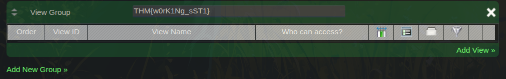

What is SSTI?
SSTI (Server-Side Template Injection) is a vulnerability where user input is directly passed into a template engine without sanitization. Template engines like Twig, Jinja2, or Smarty are used by web apps to dynamically render HTML. When user input is evaluated as template code instead of plain text, an attacker can execute commands on the server.

Think of it like this — the app expects you to give it a name, but you give it a command instead, and the server actually runs it.

Target
Platform: TryHackMe
Room: Server-Side Template Injection
Challenge: Extra Mile Challenge
Target App: FormTools — a form management web application
Step 1 — Finding the Vulnerability
After logging into the FormTools application, I navigated to:

Forms → Add Form → Internal Form

I created a test form with the name test and 5 fields.

Then opened it and went to the Views tab. Inside the Views tab, there was a Add New Group” input field. This field is normally used to name/group views — but it was directly rendered by the template engine without any sanitization.

Step 2 — Confirming SSTI
To confirm the vulnerability, I used the classic SSTI detection payload:

{{7x7}}
Result: The field displayed 49 instead of the literal text {{7x7}}

This confirmed that the template engine was evaluating our input as code — meaning SSTI vulnerability exists here.

Step 3 — Command Execution with exec()
Since the template engine was executing our input, I tried running a system command using the exec() function:

{{exec('ls')}}
Result: The server returned a .php file but the flag file was not visible at the root level.

Step 4 — Finding the Flag File
Since ls alone didn't show the flag, I tried searching specifically for .txt files inside the web directory using a recursive listing:

{{exec('ls -r /var/www/html/*.txt')}}
Result: The server returned a file path:

/var/www/html/105e15924c1e41bf53ea64afa0fa72b2.txt
The flag was stored in a .txt file with a long random name.

Step 5 — Reading the Flag
Now that I had the exact file path, I replaced ls -r with cat and used the full filename to read its contents:

{{exec('cat /var/www/html/105e15924c1e41bf53ea64afa0fa72b2.txt')}}

Result: THM{w0rK1Ng_sST1}

How to Fix This Vulnerability

. Never pass raw user input directly into template engines

. Use input sanitization — escape special characters like {, }, (

. Use sandboxed template environments that block exec() and system calls

. Apply least privilege web server should not have shell execution permissions

Written by: hitesh_null | Platform: TryHackMe Topic: Server-Side Template Injection (SSTI)
